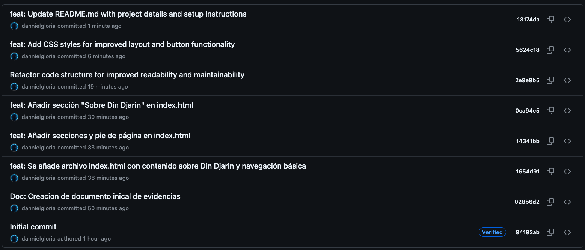
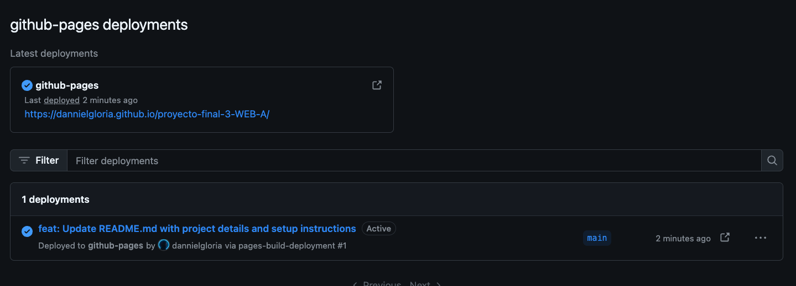

# Evidencias del Proyecto

En este documento se recopilan las evidencias del desarrollo del
proyecto, incluyendo capturas de pantalla relevantes y el acceso a la
página desplegada en GitHub Pages.

------------------------------------------------------------------------

## 📂 Ubicación de las evidencias

Todas las imágenes se encuentran dentro de la carpeta:

    /evidencias

> Asegúrate de mantener nombres claros para cada archivo, por ejemplo:
>
> -   `historial-commits.png`
> -   `github-pages.png`

------------------------------------------------------------------------

## 🧾 Historial de Commits

------------------------------------------------------------------------

## 🌐 Vista de GitHub Pages

------------------------------------------------------------------------

## 🔗 Enlace a la página desplegada

👉 **GitHub Pages:**\
`https://dannielgloria.github.io/proyecto-final-3-WEB-A/`

------------------------------------------------------------------------

# Aprendizajes

## 1. ¿Qué fue lo más fácil y lo más retador?

**Respuesta:**\
*Aprender a que no debo de poner un repo dentro de otro repo*

------------------------------------------------------------------------

## 2. ¿Qué etiquetas semánticas usaste y por qué?

**Respuesta:**\
*header, main, section, article,
footer, etc.*

------------------------------------------------------------------------

## 3. ¿Cómo organizaste tus commits?

**Respuesta:**\
*Realize comits cada que realizaba un gran cambio o cambio importante.*
------------------------------------------------------------------------

## 4. ¿Qué mejorarías en la siguiente iteración?

**Respuesta:**\
*Mejoraria el uso de css y meteria JS.*

